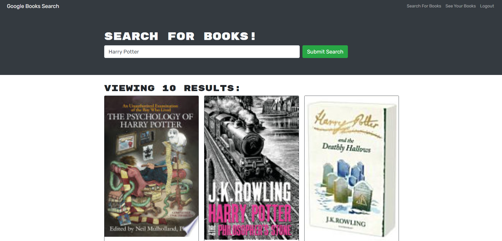

# Lucas-Saaler-Book-Search

## Description

This application allows users to search for and save books using Google Books API.

## Table of Contents

- [License](#license)
- [Installation](#installation)
- [Usage](#usage)
- [Credits](#credits)

## License

## Installation

After you download this application, run "npm i" in your terminal to install the required libraries (this may take a few minutes depending on your hardware speed).

## Usage

When you have the website pulled up, you can search for a book with the search bar. Click the "Submit Search" button to populate the page with results from the Google Books API. If you are not logged in, you will be able to look at the books that populate the page but not save them, so be sure to register an account or log in if you want to be able to save books.

To save a book, simply click the "Save this Book!" button at the bottom of any book card. Any book you have saved can be viewed by clicking "See Your Books" in the navbar. Doing so will populate the page with books you have previously saved.

When on the saved books page, you can delete a saved book by simply clicking the "Delete this Book!" button at the bottom of any book card.

Deployed website found here: https://lsaa-book-search.herokuapp.com/

## Credits

The starter code for this application was provided by the Ohio State University coding bootcamp. I wrote the rest of this code myself using React, Javascript, Express, Apollo, Mongoose, and the Google Books API.